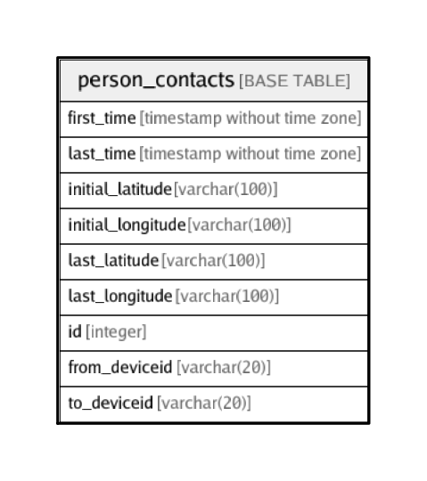

# person_contacts

## Description

## Columns

| Name | Type | Default | Nullable | Children | Parents | Comment |
| ---- | ---- | ------- | -------- | -------- | ------- | ------- |
| first_time | timestamp without time zone |  | true |  |  |  |
| last_time | timestamp without time zone |  | true |  |  |  |
| initial_latitude | varchar(100) |  | true |  |  |  |
| initial_longitude | varchar(100) |  | true |  |  |  |
| last_latitude | varchar(100) |  | true |  |  |  |
| last_longitude | varchar(100) |  | true |  |  |  |
| id | integer | nextval('person_contacts_id_seq'::regclass) | false |  |  |  |
| from_deviceid | varchar(20) |  | true |  |  |  |
| to_deviceid | varchar(20) |  | true |  |  |  |

## Constraints

| Name | Type | Definition |
| ---- | ---- | ---------- |
| person_contacts_id_key | UNIQUE | UNIQUE (id) |

## Indexes

| Name | Definition |
| ---- | ---------- |
| person_contacts_id_key | CREATE UNIQUE INDEX person_contacts_id_key ON public.person_contacts USING btree (id) |

## Relations

---

> Generated by [tbls](https://github.com/k1LoW/tbls)
